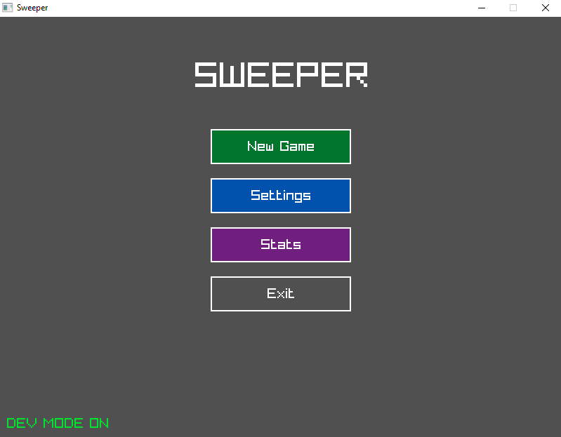
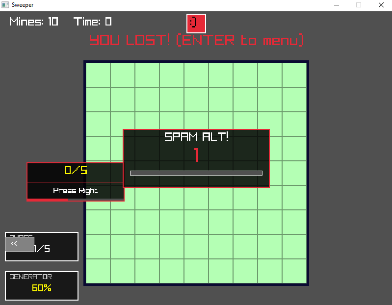
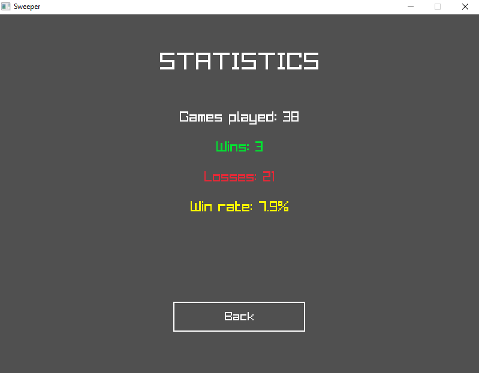
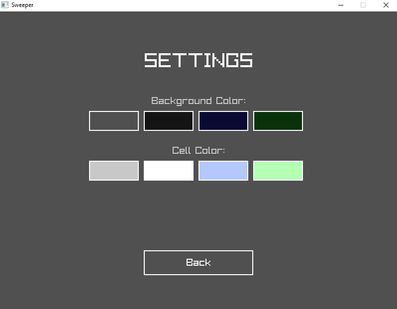

# Sweeper

Многозадачный сапёр с уникальными врагами.

## Технологический стек
- C (C11)
- Raylib 6.0
- MinGW-w64 (GCC)
- Unity Test Framework (для модульных тестов)

## Статус проекта
Разработка завершена. Все основные механики и враги реализованы, тесты проходят.

## Управление
- **Левая кнопка мыши** – открыть клетку, взаимодействовать с меню и врагами.
- **Правая кнопка мыши** – поставить/снять флаг, отбить Jumpscare-врага.
- **Shift (зажать)** – заряжать генератор.
- **Alt (быстро нажимать)** – отбить Spam-врага.
- **Стрелки (↑↓←→)** – выполнить последовательность QTE-врага.
- **F11** – полноэкранный режим.
- **F1–F4** – вызвать врагов (только в Dev-режиме).
- **IDDQD** – чит-режим (в игре).
- **DEVCOMMANDS** – Dev-режим (в главном меню).

## Скриншоты

## Запуск
1. Установите MinGW-w64 и Raylib 6.0.
2. Склонируйте репозиторий.
3. Убедитесь, что путь к Raylib в Makefile корректен.
4. Выполните `mingw32-make`.
5. Запустите `./sweeper.exe`.

## Тесты
`mingw32-make test`
